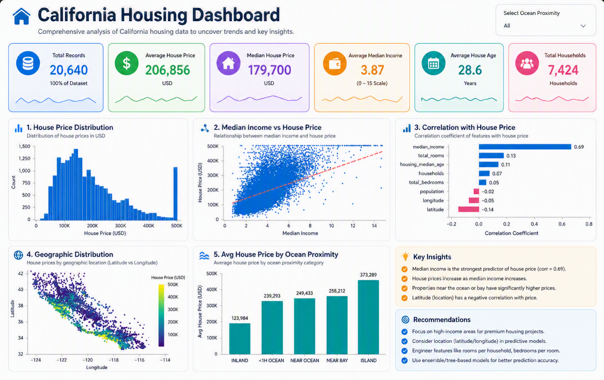

# Housing Price Prediction

A Machine Learning project focused on predicting housing prices using the California Housing dataset.
This project demonstrates a complete end-to-end ML workflow including data preprocessing, feature engineering, model training, evaluation, and prediction export.

---
## Insights



## Insights & Business Answers

- **What are the main drivers of house prices?**
  - Median income is the strongest predictor of median house value. Areas with higher median income tend to have higher house prices.
  - Proximity to the ocean and location-related factors (neighborhood desirability) increase prices.
  - Housing features such as rooms per household, bedrooms-per-room ratio, and housing median age also influence prices.

- **Where should investors focus?**
  - Prioritize neighborhoods with above-average median income and lower population density, especially those closer to the coast or with strong local amenities.
  - Look for properties with favorable rooms-per-household and lower household crowding (lower bedrooms/rooms ratio).

- **Which features should the model prioritize?**
  - Median income, rooms_per_household, population_per_household, proximity-to-ocean (or a location proxy), and housing_median_age.
  - Create derived features (rooms_per_household, bedrooms_per_room, population_per_household) — they improve model performance.

- **Recommended next steps for the business**
  - Collect additional location and amenity features (school quality, transport links) to improve predictions.
  - Perform hyperparameter tuning and feature selection to further improve model accuracy.
  - Deploy a dashboard to visualize predicted values and highlight high-opportunity neighborhoods for investment.

---

## 📌 Project Overview

In this project, I performed:

* Exploratory Data Analysis (EDA)
* Data visualization
* Correlation analysis between variables
* Train-test splitting using stratified sampling
* Missing value handling using `SimpleImputer`
* Categorical feature encoding using `OneHotEncoder`
* Feature scaling using `StandardScaler`
* Automated preprocessing using `Pipeline`
* Combined preprocessing using `ColumnTransformer`
* Model training using multiple regression algorithms
* Model evaluation using RMSE and Cross Validation
* Prediction export into a `.csv` file

The goal of this project is to build an optimized regression model capable of accurately predicting median house prices.

---

## 📦 Project Structure

```text
California-Housing-Prediction/
│___ jupyter notebook
├── main.py
├── housing.csv
├── output1.csv
├── requirements.txt
├── .gitignore
└── README.md
```

---

## 🛠 Technologies & Libraries Used

* Python
* Pandas
* NumPy
* Scikit-learn
* Power BI

---

## 📂 Machine Learning Workflow

### 1️⃣ Data Preprocessing

* Loaded the housing dataset
* Checked missing values and handled them using:

  * `SimpleImputer(strategy="median")`
* Encoded categorical features using:

  * `OneHotEncoder`
* Standardized numerical features using:

  * `StandardScaler`

---

### 2️⃣ Feature Engineering

* Created income categories for stratified sampling
* Performed train-test splitting using:

  * `StratifiedShuffleSplit`

---

### 3️⃣ Pipeline Automation

Created automated preprocessing pipelines for:

* Numerical features
* Categorical features

Combined them using:

* `ColumnTransformer`

This makes the preprocessing workflow clean, reusable, and production-friendly.

---

## 🤖 Models Used

The following regression models were tested:

* Linear Regression
* Decision Tree Regressor
* Random Forest Regressor

After evaluation, **RandomForestRegressor** provided better accuracy compared to other models.

---

## 📊 Model Evaluation

The models were evaluated using:

* RMSE (Root Mean Squared Error)
* Cross Validation

These evaluation techniques helped measure the model's prediction performance and generalization capability.

---

## 📁 Output

The final predictions were saved into a `.csv` file for further analysis and usage.

Example:

```text
output1.csv
```

---

## 🚀 Future Improvements

* Hyperparameter tuning
* Feature selection
* Model deployment using Flask or FastAPI
* Web interface integration
* Model serialization using Joblib or Pickle

---

## 📚 Learning Outcomes

Through this project, I gained hands-on experience in:

* Data preprocessing
* Building ML pipelines
* Feature scaling and encoding
* Model evaluation techniques
* Regression algorithms
* Cross-validation
* End-to-end machine learning workflow

---

## ⭐ Conclusion

This project helped me understand how real-world machine learning pipelines are built and evaluated using industry-standard preprocessing and modeling techniques.
